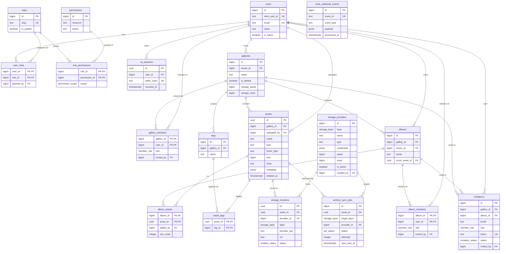

# Entity-Relationship Diagram

Visual model of Filora's schema. Mirrors [`schema.sql`](../../apps/api/internal/database/schema.sql);
for exact column types and constraints see [schema.md](./schema.md).

> Rendering: the diagram below uses [Mermaid](https://mermaid.js.org/). GitHub, VS Code,
> and most Markdown viewers render it natively.

---

## Diagram

> `storage_account_usage` is a **view** (not a table) summarizing usage per
> storage account; it is omitted from the ERD.

---

## Relationships

| From | To | Cardinality | On delete | Notes |
|------|----|-------------|-----------|-------|
| `user_roles.user_id` | `users.id` | many-to-one | CASCADE | A user's set of roles = their "role group" |
| `user_roles.role_id` | `roles.id` | many-to-one | CASCADE | |
| `user_roles.granted_by` | `users.id` | many-to-one | SET NULL | Who assigned the role |
| `role_permissions.role_id` | `roles.id` | many-to-one | CASCADE | |
| `role_permissions.permission_id` | `permissions.id` | many-to-one | CASCADE | Grant carries a `scope` (`own`/`all`) |
| `cli_sessions.user_id` | `users.id` | many-to-one | CASCADE | Many concurrent terminal sessions per user |
| `galleries.owner_id` | `users.id` | many-to-one | CASCADE | Each user has 1 default gallery |
| `gallery_members.gallery_id` | `galleries.id` | many-to-one | CASCADE | Local role: owner/editor/viewer |
| `gallery_members.user_id` | `users.id` | many-to-one | CASCADE | Owner also has a member row |
| `gallery_members.invited_by` | `users.id` | many-to-one | SET NULL | |
| `assets.gallery_id` | `galleries.id` | many-to-one | CASCADE | Asset lives in exactly one gallery |
| `assets.uploaded_by` | `users.id` | many-to-one | SET NULL | Contributor; used for `own` scope; dedup unique `(gallery_id, hash)` |
| `albums.gallery_id` | `galleries.id` | many-to-one | CASCADE | Album nested in a gallery |
| `albums.owner_id` | `users.id` | many-to-one | CASCADE | |
| `albums.cover_asset_id` | `assets.id` | many-to-one | SET NULL | Optional cover image |
| `album_members.album_id` | `albums.id` | many-to-one | CASCADE | Owner can invite users |
| `album_members.user_id` | `users.id` | many-to-one | CASCADE | |
| `invitations.gallery_id` | `galleries.id` | many-to-one | CASCADE | Set for a gallery invite (CHECK: exactly one target) |
| `invitations.album_id` | `albums.id` | many-to-one | CASCADE | Set for an album invite |
| `invitations.invited_by` / `accepted_user_id` | `users.id` | many-to-one | SET NULL | Sender / accepted user |
| `album_assets.album_id` | `albums.id` | many-to-one | CASCADE | M2M: asset ↔ album |
| `album_assets.asset_id` | `assets.id` | many-to-one | CASCADE | |
| `tags.gallery_id` | `galleries.id` | many-to-one | CASCADE | Tag vocabulary is per gallery; unique `(gallery_id, name)` |
| `asset_tags.asset_id` | `assets.id` | many-to-one | CASCADE | M2M: asset ↔ tag |
| `asset_tags.tag_id` | `tags.id` | many-to-one | CASCADE | |
| `assets.deleted_by` | `users.id` | many-to-one | SET NULL | Soft-delete (trash) actor |
| `storage_locations.asset_id` | `assets.id` | many-to-one | CASCADE | Each asset gets ≥1 serving + ≥1 archive copy |
| `storage_locations.provider_id` | `storage_providers.id` | many-to-one | **RESTRICT** | Can't delete an account still hosting files; unique `(asset_id, provider_id)` |
| `archive_sync_jobs.asset_id` | `assets.id` | many-to-one | CASCADE | Async replication into a layer |
| `archive_sync_jobs.provider_id` | `storage_providers.id` | many-to-one | SET NULL | Chosen account (election = backlog) |
| `storage_providers.created_by` | `users.id` | many-to-one | SET NULL | Audit only; accounts are global |

> `clerk_webhook_events` has no foreign keys (idempotency log for Clerk webhooks).

---

## Logical groupings

- **Identity & access**: `users`, `roles`, `permissions`, `role_permissions`, `user_roles`, `cli_sessions`, `clerk_webhook_events`
  (Clerk mirror + RBAC + terminal sessions — see [rbac.md](./rbac.md)).
- **Organization**: `galleries`, `gallery_members`, `albums`, `album_members`, `invitations`, `album_assets`, `tags`, `asset_tags`.
- **Assets & storage**: `assets`, `storage_locations`, `storage_providers`, `archive_sync_jobs`
  (metadata is truth; two storage layers — see [schema.md](./schema.md#storage)).
